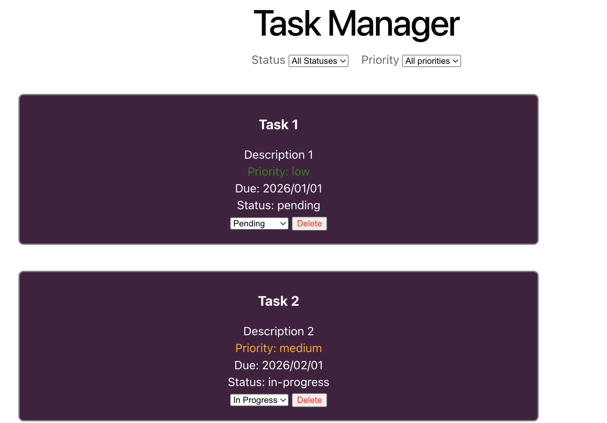

# Task Manager

A simple task management application built with React and Typescript. This allows user to view, filter, update, and delete tasks based on their status and priority.

## Features

- Display a list of tasks with title, description, due date, status, and priority
- Filter tasks by status and priority
- Change task status (Pending -> In Progress -> Completed)
- Delete tasks from the list
